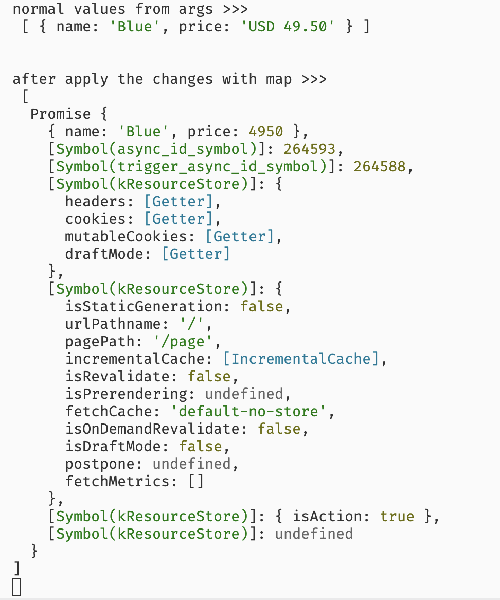
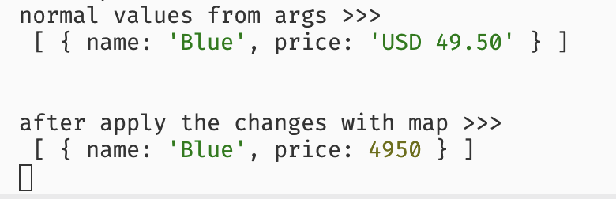

This is just a small reproduction code for this problem: https://twitter.com/uselessdevelop/status/1769447215309668656

To reproduce:

```bash
git clone git@github.com:uselessdev/idk.git
cd idk && pnpm install # npm install
pnpm run dev # npm run dev
```

navigate to http://localhost:3000 and click the buttons

When click in the button **Submit Button** can see this log:



When click in the button **With Fixed Action**:



## Note

First I think the problem was in the server action itself (maybe some weirdo internal of next), but looks like the problem is the `create-server-action.ts` implementation, I still don't know what is wrong but I'll keep investigating.
